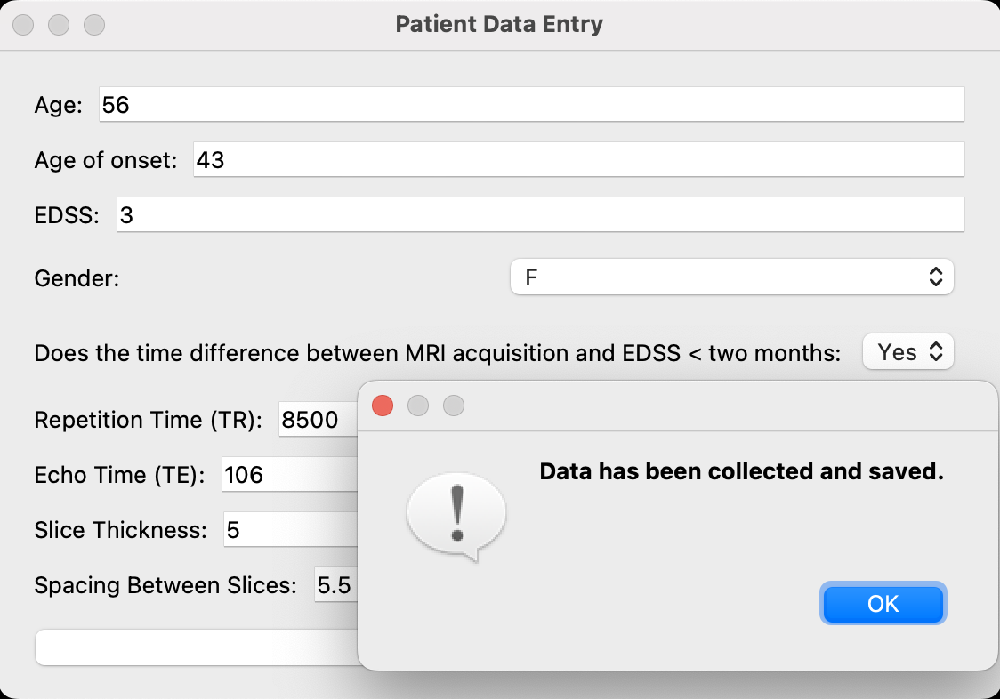

# NeuroGPT: AI-Powered MRI Insights & Reporting 🤖💡

## 🏥 Revolutionizing Medical Imaging with Generative AI & Deep Learning

This repository presents an **AI-driven system** that combines **Deep Learning** and **Generative AI** to automate lesion detection in brain MRI scans and generate detailed clinical reports. By integrating cutting-edge **computer vision, feature extraction, and NLP-based Generative AI**, this system reduces manual workload, improves diagnostic accuracy, and ensures consistent medical documentation. 

---

## Tech Stack

### 🎯 **Core AI Components**
- **3D U-Net Segmentation** – Detects lesions in MRI scans using a state-of-the-art encoder-decoder architecture.
- **Hybrid 3D CNN** – Extracts essential imaging and demographic features.
- **Generative AI (LLM-based, Google Gemini API)** ✍ – Processes extracted data and historical MRI cases to generate structured clinical reports.

### 💾 **Model Stack & Frameworks**
- **Deep Learning** : `PyTorch`, `TensorFlow`, `MONAI`
- **Generative AI** : `Google Gemini API`, `Hugging Face Transformers`
- **Computer Vision** : `OpenCV`, `SciPy`, `SimpleITK`
- **Frontend & UI** : `PyQt5`, `Tkinter`

---

## 🏗️ System Architecture

### **1️⃣ MRI Segmentation – 3D U-Net**
🔬 **Architecture**:  
- Contracting path (downsampling) for feature extraction  
- Expanding path (upsampling) for precise localization  
- Skip connections for spatial preservation  
- Optimized with **DiceCELoss** & **FocalLoss**

📊 **Performance Metrics**:  
- **Specificity**: `0.9968`  
- **Sensitivity**: `0.5515`  
- **Precision**: `0.7635`  
- **Dice Coefficient**: `0.3621`  

### **2️⃣ Feature Extraction – Hybrid 3D CNN**
🔍 **Processing Steps**:  
- Extracts **spatial lesion features** (size, shape, texture)  
- Incorporates **patient demographics** (age, gender, history)  
- Uses **Leaky ReLU**, **Dropout Layers**, and **Fully Connected Layers**

📊 **Performance Metrics**:  
- **Precision**: `0.7000`  
- **Recall**: `0.6728`  
- **F1-Score**: `0.6839`  
- **PR AUC**: `0.7078`  

### **3️⃣ Generative AI for Report Generation – Google Gemini API**  
**How it Works**:  
1. **Model Training with Historical MRI Scans**  
   - The **Gemini API** was trained by uploading **old MRI scans** to its system.  
   - **Gemini stores case history**, allowing it to recognize patterns across previous cases.  
   
2. **Real-time Report Generation Process**  
   - **Step 1:** User provides an **MRI scan file** via the GUI.  
   - **Step 2:** The system **loads the scan into the 3D U-Net model**.  
   - **Step 3:** **Lesion segmentation mask** is generated and sent to **Simple3D CNN**.  
   - **Step 4:** **Simple3D CNN processes** both segmentation masks and **patient demographics** to predict medical parameters.  
   - **Step 5:** The system **makes an API call to Gemini**, which:  
     - Reads historical MRI case **history stored in Gemini API**.  
     - Loads the **new scan data** and **predicted parameters** from Simple3D CNN.  
     - Generates a **structured medical report** based on predefined templates.  
   - **Step 6:** The final **PDF report is generated and saved**.


<h2 align="center">Program Output Screenshots</h2>

<table align="center">
  <tr>
    <td align="center">
      
      <br/><b>Figure 1:</b> User Interface for Data Entry and MRI Scan Specification
    </td>
    <td align="center">
       
       <br/><b>Figure 2:</b> Segmentation Output of the model (slice adjustable in code)
    </td>
  </tr>
</table>


## 📄 Generated Report

An example of the **AI-generated medical report** can be accessed at the following link:

🔗 **[View AI-Generated Report](https://atchudhansg.github.io/NeuroGPT-AI-Powered-MRI-Insights-Reporting/)**

For hosting purposes, the report file has been renamed to **index.html**.


🚀 **Advantages of This Approach**:  
- **Context-Aware Reports** 📜 – **Gemini leverages historical cases** to improve report accuracy.  
- **Demographic-Specific Insights** 👤 – Predictions adapt to **patient history & imaging**.  
- **Fully Automated AI Workflow** 🔄 – No manual data entry required for clinical insights.  

---

## 🛠️ Installation & Usage

### 🔧 **Setup & Installation**
```bash
git clone https://github.com/atchudhansg/NeuroGPT-AI-Powered-MRI-Insights-Reporting.git
cd NeuroGPT-AI-Powered-MRI-Insights-Reporting
pip install -r requirements.txt

```
### 🚀 **Run the System**
```bash
python Final.py
```
**Pipeline Execution:**  
✅ **Step 1:** Upload MRI scan via GUI  
✅ **Step 2:** System loads scan → 3D U-Net performs segmentation  
✅ **Step 3:** Segmentation mask sent to Simple3D CNN  
✅ **Step 4:** Demographic values + predictions passed to Gemini API  
✅ **Step 5:** Gemini generates the final structured medical report  
✅ **Step 6:** Report saved as **PDF** for clinical review  

---

## 🌟 Future Enhancements  
🔮 **Advanced GenAI Architectures**  
- Fine-tuning **multi-modal LLMs** (text + images) for more advanced report generation.  
- Training **Gemini AI** on a larger dataset of annotated medical records.  

📈 **Enhanced Training & Dataset Expansion**  
- Using **self-supervised learning** for feature representation.  
- Increasing **MRI dataset size** for better generalization.  

🧑‍⚕️ **Clinical Validation & AI Improvement**  
- Implementing **Human-in-the-Loop AI** where radiologists provide feedback on reports.  
- **Customizing prompt engineering** for highly accurate clinical text generation.  

---

## 🤝 Contributing  
We welcome contributions! Open an issue or submit a pull request 🚀  

## 📜 License  
This project is licensed under the **MIT License**.  

---  

⚡ **Transforming medical imaging with AI-driven intelligence!** 🏥🤖  
